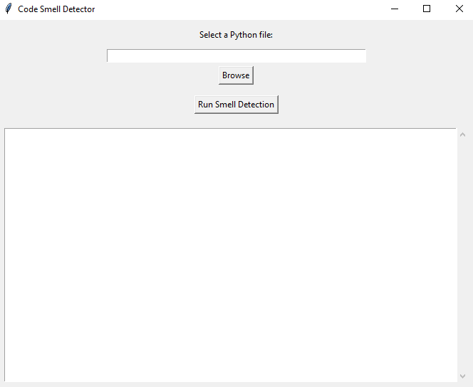
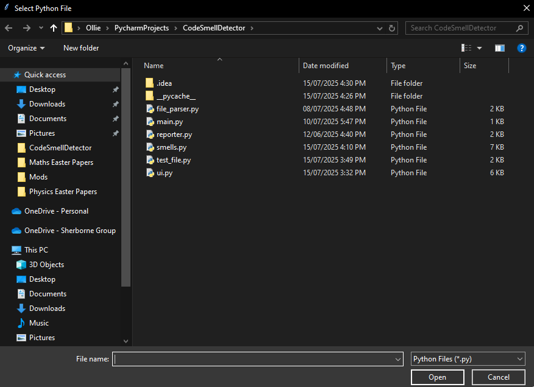
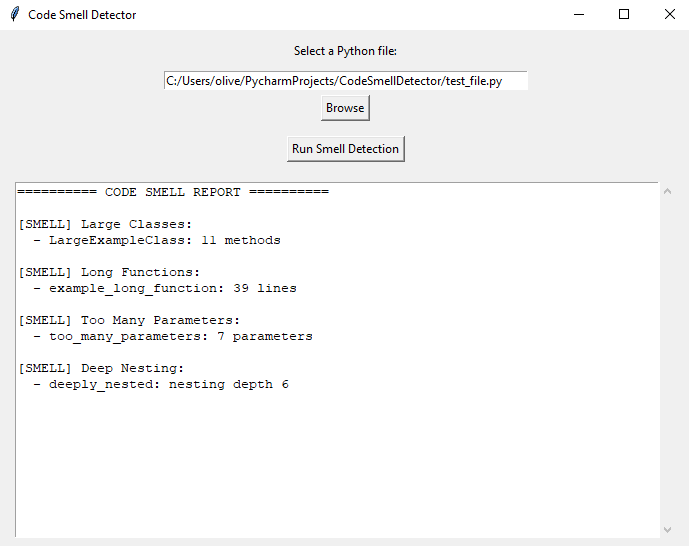

# CodeSmellDetector

This Program is a Python tool designed to analyse common code smells - indicators of potential issues that would impact
code quality, readability and maintainability. The project includes a user-friendly GUI, built with Tkinter, for 
easy interaction and inspection.

### Features

- Detect Long Functions: Flags functions that exceed a configurable number of lines, helping identify bloated methods.

- Detect Large Classes: Identifies classes with an excessive number of methods that might benefit from refactoring.

- Detect Functions with Too Many Parameters: Flags functions with complex parameter lists, which are often harder to 
  maintain.
  

- Detect Deep Nesting: Finds functions with deeply nested control structures, a common source of code complexity.

### Demo

Upon execution the user will be presented with a simple GUI:

From here clicking 'Browse' will enable the user to choose a python file (.py) from their system:

After choosing a file, the filepath will be shown in the GUI - confirming their choice. They may then click 'Run Smell
Detection':

They are then able to 'Browse' again, if not - closing the 'Code Smell Detector' window will end the program

### Future Improvements
- Add line-level highlights for detected code smells in the source preview

- Enable analysis of entire directories, not just individual .py files

- Implement additional smells (e.g. dead code, duplicate code, cyclomatic complexity)

- Export results to .txt or .md for reporting

- Allow user-configurable thresholds (e.g. function length, class size)

- Add CLI interface alongside the GUI for flexibility

- Improve test coverage, including edge cases and integration tests

- Support plugin-style detectors for easy extensibility

### Sources
https://docs.python.org/3/library/ast.html#function-and-class-definitions (Abstract Syntax Trees)
https://waylonwalker.com/python-docstring-ast/ (Docstrings in AST)
https://www.tutorialspoint.com/python/tk_button.htm (Buttons)
https://www.geeksforgeeks.org/python/file-explorer-in-python-using-tkinter/ (File explorer)